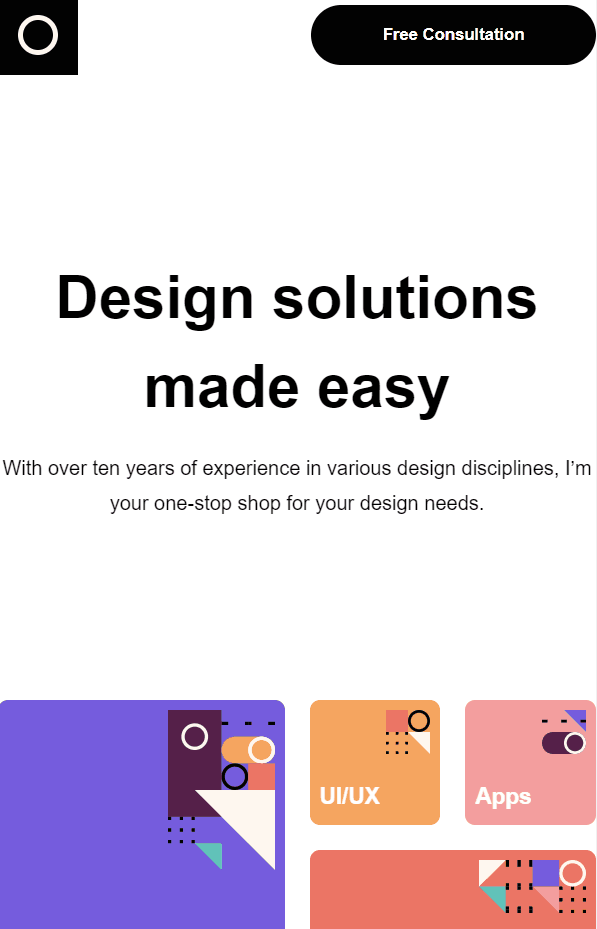

    <h1>Design System</h1>

Neste projeto pude exercitar minhas habilidades com ReactJS, styled-components, responsividade e hooks.

---

 

# Features 🪐

- [x] Esse projeto representa o portifólio de uma profissional chamada Amy, que oferece serviços em diversas áreas do Design.  
- [x] O projeto é responsivo a fim de entregar uma melhor experiência de usuário a quem acessa o site por meio de dispositivos móveis.  

---

# Tecnologias utilizadas

- [x] Javascript
- [x] ReactJs
- [x] Styled-components
- [x] React-hooks
- [x] React-reveal
- [x] Nuka Carousel

 

# Demo Desktop 📷

<h1 align = "center">
    
</h1>

# Demo Tablet 📷

<h1 align = "center">
    
</h1>

# Demo Smartphone 📷

<h1 align = "center">
    
</h1>

 

# Feito com ❤️ por Fabio Del Col Matiusso
